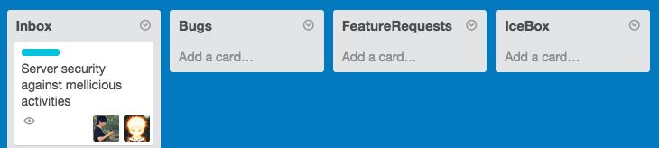
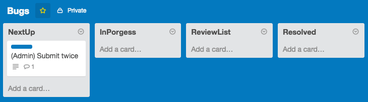
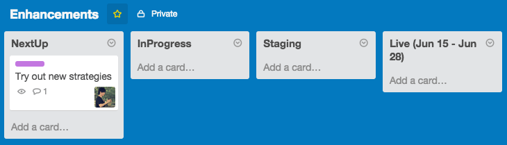

WeFlex Product Development Guide
====

<!--
  Author: Scott Wang, Alex Li
  Date:   2015/06/17
-->


For Non-Product Team Members
----

If you came from a non-product background, simply read chapter [ideas](#ideas)
and [bugs](#bugs). These chapters will talk about how to submit your ideas and
how your ideas will be converted into bugs and features and finally became
publicly available (aka. going live).


A Kanban to Manage Product Development
----

Product development is never an easy job. There are so many factors in the
process of developing a product, so many people (or roles) got evolved in it.
To make an efficient process, we have to always keep our goals simple and clear.

That's how `Kanban` and `Trello` comes in to solve the problem.
[Kanban](https://en.wikipedia.org/wiki/Kanban_(development)) is part of agile
product development. It helps the whole team to visualize tasks by stages
(**waitlist**, **next up**, **on-going**, **finished**, etc) and to see what
other people are working on.

Kanban is simple. You have `boards` made up of several columns (`lists`),
marking different stages, from left to right. Each task on this board is a
`card` (sticker), moving through lists. A card always starts from the left-most
list then moves column by column to the right-most list, and been archived at
last.

Different types of tasks have different lifecycle. Tasks in product development
have different types:
 
+ Enhancements (new features)
+ Bug fixes
+ Docs
+ Tooling

Among them, `enhancements` and `bug fixes` are the most critical tasks, and we
will spent most of our time working on them.

To visualize tasks and stages, we feed all our working items into three boards:
    
+ Ideas
+ Bugs
+ Enhancements

Now we can use boards to organize tasks and lists to organize statuses, let's
use Kanban to manage product development workflow.


Ideas
----

Given its difficulty, product development is never an unattainable procedure.
Like other engineering problems, we can solve it by careful analysis and
planning. There are different stages during a full cycle of product development,
to make tiny ideas going live.



Any improvement of a product starts as an idea. To begin with, go to `Ideas`
board, create a card in `Inbox` list, write down your idea.

Ideas could be a few sentences describing a problem users are facing, a user
complain, or your vision about this product. It could be general and
unorganized. Just leave it and product team will discuss and evaluate ideas in
`Inbox` on the next `product review` meeting.


Task Lifecycle
----

<!-- TODO: explain -->

+ task waitlist (next-up)
+ work in progress
+ functional testing (staging)
+ going live

Each stage above has its corresponding task-list in `Bugs` and `Enhancements`
board.

### Bugs



In `Bugs` board, we got four lists: `NextUp`, `InProgress`, `ReviewList` and
`Resolved`. Any bug-fix task transferred to `Bugs` will first wait in the
`NextUp` list to wait for being assigned to a engineer and then it will move on
to `InProgress`.

Once the assignee think the bug is fixed, he could move the item to `ReveiwList`
with a Github commit and PR link to mark it for further reviews. 

Bugs will be verified and code-reviewed by another developers at Github PR page 
at first, if and only if this hotfix gets at least one `LGTM` or `SGTM` on Github, 
one of team members is able to merge this into proper branch(s). And the commiter 
would update it in `Bugs` board to make sure that the bug is fixed and the fix is 
clean.

Result in board will be either `accepted` or `rejected`:

An `accepted` sign-off means this bug is fixed and will be in the bug fix list
of next release. The developer helped verify the bug should follow the steps:

1. Squash all the commits from PR page into 1 commit with a graceful message.
2. In the commit message, we should have the following information to be set:
  1. `Fixes #<PR-NUM>` in this way, we are able to quickly find the related PR from commit and find the related commits from PR as well.
  2. `CARD: <URL>` reference to the card url in bugs board
  3. `Reviewed-By: @<github-username>` this flags who reviewed this PR
3. Submit a comment on the related card with the hash string of hotfix commit and related PR.

Therefore, the entire example of a squashed commit looks like:

```
Don't send an email to operator
[other messages...]

Fixes #12
CARD: https://trello.com/xxxxxx
Reviewed-By: @yorkie
```

The example card comment:

```
This bug has been fixed via https://github.com/weflex/product-development-guide/commit/cf96be684c8c5c79618260d10418795c0736c69b.

Related PR: https://github.com/weflex/product-development-guide/pull/1
```

(Note: 1st line of message should be less than 50 characters)

If `rejected`, card will be push back to `InProgress` again and assignee has to
re-fix it.

### Enhancements



Similar to the `Bugs`, the `Enhancements` board also come with four lists,
`NextUp`, `InProgress`, `Staging` and `Live`. Each card in `Enhancements`
travels from the left-most `NextUp` waitlist and ends up in going `Live`.

A card moves into `Staging` list means it coding (if needed) is done and now
it's time to verify its functions. This step would usually take a couple of
days to a week.

If the feature is correct (function-wise) and stable, we will move the card to
`Live` and put it into production.

`Work In Progress` items in `Enhancement` workflow may be in these types:

+ user interview
+ design
+ implementation
+ integration/unit testing


Meetings
----

As you may noticed, the method I proposed in this guide involved meetings. There
are three types of meetings in this system.


### Product Reviews

Product reviews are organized by product manager at the beginning of each cycle,
team members who submitted ideas will talk about the story behind it and the
product team will identify:

+ is it a bug or a enhancement?
+ is it worth working on?

Finally, based on the discussion, product manager will decide bugs and features
to work on for the next cycle. Those cards move on to `Enhancements` and `Bugs`
board.


### Progress Checkpoints

Progress checkpoints are meetings held by project manager in the middle of each
product cycle to check if everyone is on the right course and project target is
achievable at the end of this cycle. Project manager is responsible to alert and
offer possible helps to those team members lagering the schedule.


### Demo days

At the end of a product cycle, we will host a demo day for feature owners
(engineers, designers) to demonstrate what he have done in the past cycle and
celebrate his achievement together with the whole team.


References
----

1. Richard White,
   [How we use trello & google docs to make UserVoice better every day](http://community.uservoice.com/blog/trello-google-docs-product-management/)

2. Stanislav Jonak,
   [Kanban for software development](http://wiretech.org/about-cloud/11-kanban-for-software-development)
